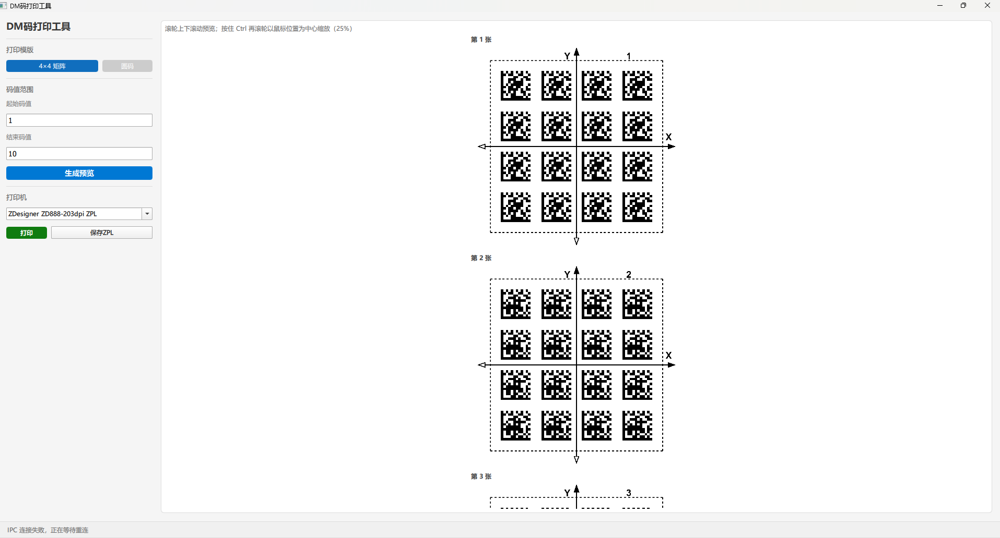
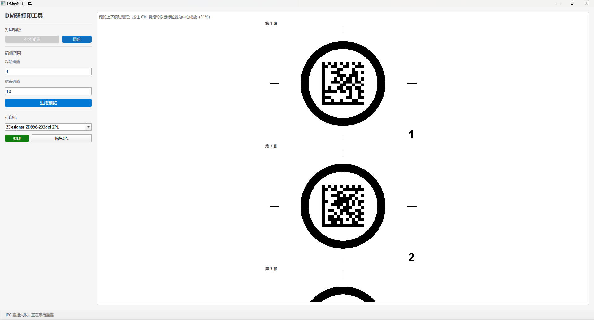

# DM 码打印工具 - 软件简介

## 1. 软件功能概述

**DM 码打印工具**是一款基于 Python + PySide6 + QML 的专业桌面应用，用于生成和打印二维数据矩阵(Data Matrix/DM 码)标签。该工具支持批量生成 DM 码、实时预览标签效果、直接打印到 Zebra 热转印打印机，以及导出 ZPL 打印指令。适用于产品编码、资产管理、物流追踪等工业应用场景。

## 2. 适用硬件配置

### 2.1 打印机设备


| 设备类型   | 推荐型号                     | 连接方式 | 备注            |
| ------ | ------------------------ | ---- | ------------- |
| 热转印打印机 | Zebra ZD888T / ZD621T    | USB  | 需要安装 Zebra 驱动 |
| 标签纸    | 100 x 100 / 80 x 60热转印标签 | -    | 支持 DM 码打印     |
| 碳带     | 混合基碳带（推荐）                | -    | 宽度需与纸张匹配      |


### 2.2 电脑配置


| 配置项    | 最低要求                   | 推荐配置               |
| ------ | ---------------------- | ------------------ |
| 操作系统   | Windows 10 / 11 (64 位) | Windows 11         |
| 存储     | 100 MB 可用空间            | 500 MB 可用空间        |
| Python | 3.10+                  | Python 3.12.4 (推荐) |


## 3. 主要功能模块

### 3.1 DM 码生成模块

- **支持多种编码格式**：4×4 矩阵码、圆形码
- **批量生成**：支持输入起始码和结束码，自动生成范围内的所有 DM 码

### 3.2 标签预览模块

- **实时预览**：修改参数后立即生成预览图像
- **所见即所得**：预览效果与打印效果一致
- **批量显示**：最多显示前 10 张标签预览，支持查看总数统计

### 3.3 打印输出模块

- **本地打印**：直接连接到 Zebra 热转印打印机
- **打印机管理**：自动检测可用打印机，支持动态刷新打印机列表
- **实时反馈**：打印过程中实时显示进度和状态

### 3.4 数据导出模块

- **ZPL 指令导出**：导出标签对应的 Zebra 打印语言(ZPL)指令
- **文件保存**：支持保存为 .zpl 文件，便于后续编辑或其他系统调用
- **灵活应用**：导出的 ZPL 指令可用于自动化打印流程

### 3.5 系统状态模块

- **实时状态栏**：显示操作结果和错误提示
- **进度追踪**：批量操作时显示当前进度（如"正在打印 5/100"）
- **外部通信**：支持与其他应用通过 IPC（进程间通信）协作

## 4. 用户界面截图

### 4.1 主界面布局

主界面

**界面说明：**

- **左侧面板**：包含打印模板选择、码值范围输入、打印机选择、操作按钮
- **右侧面板**：显示标签预览缩略图和状态信息
- **菜单栏**：文件、编辑、帮助等功能菜单

### 4.2 打印模板选择

打印模板

支持两种打印模板：

- **4×4 矩阵**：标准矩阵排列，每张 16 个 DM 码
- **圆码**：圆形排列，每张 1 个 DM 码

### 4.3 码值输入界面

码值输入

输入起始码和结束码，系统自动计算需要打印的标签总数和 DM 码总数。

### 4.4 标签预览区域

标签预览

实时显示生成的标签预览，最多显示 10 张，支持滚动查看。

### 4.5 打印机选择和操作

打印机选择

支持从下拉列表选择打印机(所有支持ZPL打印流的打印机)，显示打印进度和操作结果。

## 5. 主要特性


| 特性            | 描述                            |
| ------------- | ----------------------------- |
| 🎨 **现代化界面**  | 基于 Qt 6.8 的 Fusion 风格，跨平台一致性强 |
| ⚡ **高效批处理**   | 支持一次性生成和打印数百张标签               |
| 👁️ **实时预览**  | 修改参数后立即显示标签效果                 |
| 🖨️ **多格式支持** | 支持矩阵码和圆形码两种编码方式               |
| 💾 **数据导出**   | 支持 ZPL 指令导出，便于集成和自动化          |
| 🔄 **IPC 通信** | 支持与其他应用程序协作                   |


## 6. 工作流程

```
┌─────────────────────┐
│  选择打印模板      │  (4×4 矩阵 / 圆码)
└──────────┬──────────┘
           │
┌──────────▼──────────┐
│  输入码值范围      │  (起始码和结束码)
└──────────┬──────────┘
           │
┌──────────▼──────────┐
│  生成标签预览      │  (实时显示)
└──────────┬──────────┘
           │
           ├─────► 满意 ──────┐
           │                  │
           └─────► 调整参数   │
                              │
                    ┌─────────▼──────────┐
                    │  选择打印机        │
                    └─────────┬──────────┘
                              │
                    ┌─────────▼──────────┐
                    │  打印标签 / 导出   │
                    │   ZPL 指令         │
                    └────────────────────┘
```

## 7. 常见应用场景

### 为AGV打印两种外形的DM码地面标签

## 8. 技术栈


| 组件        | 版本      | 用途             |
| --------- | ------- | -------------- |
| Python    | 3.12.4  | 核心运行时          |
| PySide6   | 6.8.2.1 | GUI 框架         |
| Qt        | 6.8.x   | 底层库            |
| pylibdmtx | ≥0.1.9  | DM 码编码         |
| Pillow    | ≥10.0.0 | 图像处理           |
| pywin32   | ≥306    | Windows API 调用 |


## 9. 获取帮助

- **环境配置**：参考 `[env_setup.md](./env_setup.md)` 文档
- **常见问题**：查阅 `[env_setup.md` 第 12 节](./env_setup.md#12-常见问题)

---

**注意**：运行本工具前，请确保已正确安装 Python、依赖包和必要的系统运行库。详见 `[env_setup.md](./env_setup.md)` 文档。  


## 10. 运行截图

### 4x4界面


### 圆码界面
